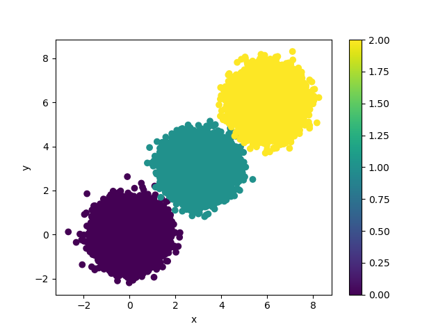
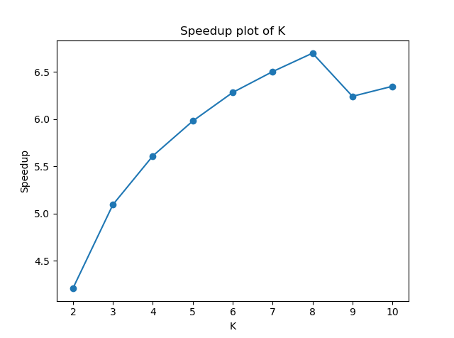

# K-Means Clustering: Sequential vs Parallel Implementation
## Overview

This repository presents a comparative analysis between sequential and parallel implementations of the K-means clustering algorithm. With modern processors favoring multi-core architectures over increased clock speeds, parallel algorithms are essential to leverage available computational power.

## Abstract

The parallel implementation uses **OpenMP in C++** to distribute the workload across multiple cores. Results demonstrate significant performance improvements in both execution speed and data processing capacity compared to the sequential version.

## K-Means Algorithm

K-means is an unsupervised learning algorithm for clustering problems:

1. Initialize K random centroids
2. Assign each point to the nearest centroid
3. Recalculate centroid positions as the mean of assigned points
4. Repeat steps 2-3 until convergence (centroids no longer change)

## Parallelization Strategies

### First Parallelization
Parallelizes the distance calculation and point assignment step across all data points.

### Second Parallelization (Further Optimization)
Additionally parallelizes the centroid recalculation step, where each thread computes a different cluster's new centroid. This approach works best when K is large enough to utilize all available cores.
```cpp
while centroids change do
    #pragma omp parallel for
    for each point do
        point.setCluster()
    end for
    
    #pragma omp parallel for
    for each K do
        upgradeCentroid()
    end for
end while
```

## Performance Results

### Benchmark: 2M Points with Further Parallelization
- **Dataset**: 2 million points, 4 dimensions, Gaussian distribution
- **Hardware**: Amazon EC2 t2.2xlarge (8 vCPUs)
- **Parameters**: ε=0.001, K=3, 229 iterations

| Threads | Time (s) | Speedup |
|---------|----------|---------|
| 1 | 929.93 | 1.00x |
| 2 | 485.73 | 1.91x |
| 4 | 254.99 | 3.65x |
| 8 | 166.98 | **5.57x** |

**Key Finding**: The enhanced parallelization achieved a speedup of 5.57x with 8 threads (vs. 3.14x in the first version).

### Variable K Analysis (200K Points, 200 iterations)

| K | Sequential (s) | Parallel (s) | Speedup |
|---|----------------|--------------|---------|
| 2 | 47.13 | 11.19 | 4.21x |
| 5 | 92.94 | 15.54 | 5.98x |
| 8 | 133.82 | 19.97 | **6.70x** |


## Key Insights

- Linear speedup observed up to the number of available cores
- Performance depends on K value in the second parallelization approach
- Overhead occurs when using more threads than available vCPUs
- Fixed iteration count provides more consistent speedup measurements than convergence-based stopping


